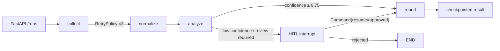

# Resilient LangGraph Agent

A compact, production-oriented reference for running checkpointed LangGraph workflows behind FastAPI. The project focuses on the engineering concerns that become important when an agent grows beyond a single prompt: conditional routing, transient retries, human review, resumability, tool boundaries, and tenant isolation.

> A reproducible engineering reference built with deterministic local fixtures, so workflow behavior can be tested without external credentials.

## Why this repository exists

Most agent demos stop at model invocation. This repository keeps the model layer replaceable and makes workflow behavior directly testable:

- **Four-stage state machine**: collect → normalize → analyze → report
- **Conditional routing**: low-confidence or high-impact runs enter human review
- **Fault tolerance**: collection retries transient adapter failures up to three times
- **Checkpoint recovery**: every run is addressed by a LangGraph `thread_id`
- **Human-in-the-loop**: interrupted runs resume through `Command(resume=...)`
- **Tenant isolation**: tenant context is enforced on tool calls, reads, and resumes
- **FastAPI boundary**: create, inspect, and resume runs through typed endpoints
- **Offline verification**: deterministic adapters keep CI fast and credential-free

## Architecture



The `EvidenceTool` protocol is the integration seam for Crawl4AI, MCP clients, RPA, search services, or internal APIs. The included adapter is intentionally local so tests never require external credentials.

## Project layout

```text
src/resilient_agent/
├── api.py       # FastAPI transport and error mapping
├── graph.py     # StateGraph nodes, routes, retry policy, interrupt
├── models.py    # Typed state and API contracts
├── service.py   # Run lifecycle and tenant authorization
└── tools.py     # Replaceable evidence adapter boundary
tests/
├── test_api.py
└── test_workflow.py
```

## Run locally

Requirements: Python 3.11+.

```bash
python -m venv .venv
source .venv/bin/activate
pip install -e '.[dev]'
ruff check .
pytest
uvicorn resilient_agent.api:app --reload
```

Create a run:

```bash
curl -X POST http://localhost:8000/runs \
  -H 'Content-Type: application/json' \
  -d '{
    "tenant_id": "brand-a",
    "query": "Compare marketplace product positioning",
    "sources": ["catalog", "marketplace"],
    "require_review": true
  }'
```

Resume after review:

```bash
curl -X POST http://localhost:8000/runs/RUN_ID/resume \
  -H 'Content-Type: application/json' \
  -d '{
    "tenant_id": "brand-a",
    "approved": true,
    "feedback": "Evidence verified"
  }'
```

## Test coverage

The test suite verifies:

1. successful end-to-end graph execution;
2. interrupt and resume after human approval;
3. cross-tenant access rejection;
4. retry after a transient collection failure;
5. FastAPI health behavior.

## Production evolution

- Replace `InMemorySaver` with a PostgreSQL-backed checkpointer.
- Implement an `EvidenceTool` adapter for MCP, Crawl4AI, RPA, or an internal gateway.
- Persist raw evidence in object storage and retain content hashes for traceability.
- Emit Session/Trace/Span telemetry to Langfuse or OpenTelemetry.
- Add per-tool budgets, server-side allowlists, idempotency keys, and dead-letter handling.
- Stream graph events to the client with Server-Sent Events or WebSocket transport.

## Tech stack

- Python 3.11+
- LangGraph 1.2
- FastAPI
- Pydantic 2
- Pytest + Ruff
- GitHub Actions
